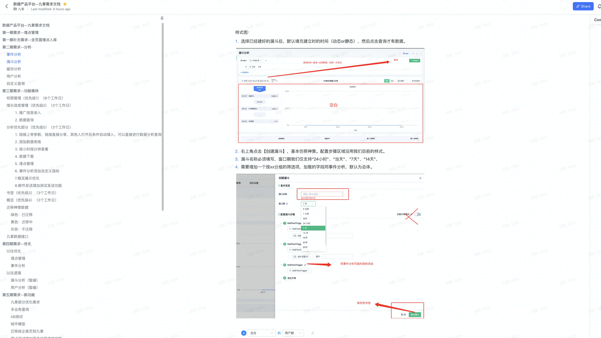

# 为什么要做数据中台

企业发展过程中，会产生各种各样的数据，这是属于企业的数据资产，但是如果不把这些数据利用起来，往往会成为企业的数字负担。有不少企业的需要不少人力来进行重复的数字整理，这使得企业的经营效率大大降低。

建设数据中台，实现企业或机构数据资产的高效管理和数据价值最大化，为企业带来数据平台化的运营机制，解决应用开发与数据开发速度不匹配的问题。利用数据中台，可以将企业的核心技术或团队凝聚在一起，建设企业内强大的数据开发、运营等团队，提升企业的团队的硬实力和软实力。

## 什么样的企业适合建设数据中台

具备以下特点的公司可以加速考虑建立数据中台：

* 企业最好有一定的信息化基础，沉淀了数据，实现了业务数据化过程；
* 企业业务复杂，有丰富的数据维度和多个业务场景，特别是多业态型集团企业；
* 企业有数字化转型、精细化经营的需求。

# 什么是数据中台

数据中台简单来说，就是一个数据处理系统，目的是提高企业的经营效率，流程可以简单概括为为：收集数据->处理数据->分析数据->数据决策，下图是一个通用的数据中台结构：

数据中台的通用体系架构如图  所示。该中台体系架构以减少功能冗余和提高功能复用为原则，把数据中台解耦为 6 个可以分别独立建设、演进的功能子系统。

数据结构与数据处理子系统是数据中台体系架构的核心，数据治理是提升数据价值的重要手段。该数据中台体系架构的通用性表现在以下几点。

* 该数据中台体系架构综合考虑了数据中台的各种要素，参考这个架构进行建设可以有效提升数据资产价值，提供数据及服务的共享。
* 参考这个数据中台体系架构，企业可以一次规划、分步实施。首先建设处理子系统及数据存储子系统，然后根据业务发展需求，逐步补充数据采集、数据安全及数据治理子系统。
* 该数据中台由 6 个解耦的子系统组成。企业在立项建设时可以灵活组合，每个子系统单独招标建设，也可以把多个子系统合并招标建设。数据中台通用体系架构包含数据存储框架、数据采集框架、数据处理框架、数据治理框架、数据安全框架及数据运营框架等 6 大部分。

## 数据存储框架

数据中台的核心是数据，数据通过采集系统获取，然后数据经过处理框架加工，并接受数据治理框架的管理，同时也要接受数据安全管理框架的管理，最后开放的价值数据将通过数据运营框架对外提供数据服务。

数据中台的数据架构应该独立规划，并采用合理的技术架构对不同类型的数据进行存储。

数据存储框架中，无论数据采用对象存储、块存储还是数据库存储技术，各种中台数据可按照上图所示分类管理。

源数据主要由采集框架进行管理，数据治理框架按照数据特征把数据简单分为结构化和非结构化数据两大类，而规范化分域数据则是数据治理框架对全量数据的规范化分域整理。宽表数据是数据关联的结果，利用宽表数据可以对人、事、地、物、组等对象进行完整的数据画像，同时宽表数据也可以作为上层模型数据的中间层数据。

元数据和标签数据都是对数据的描述，其中元数据用来对数据的客观属性进行表示，标签数据更倾向于管理者对数据的主观表述及等级划分，比如质量等级标签、安全标签、属性标签等。主数据需要在各系统间频繁更新、交换，且需要独立的存储空间进行维护管理。

## 数据采集框架

数据中台的采集框架应对纳入数据中台的各种源数据进行统一采集管理。数据采集框架中应提供多种数据采集方式，如文件传输协议采集、数据库采集、接口应用程序接入采集、流式采集及网络爬虫采集。

同时采集框架应按照数据采集规范对源数据进行预处理，从而去除明显不需要的数据及多余数据，并对采集过程进行管理。虽然数据中台的体系架构没有统一模板，但各企业数据采集框架基本一致。

## 数据处理框架

数据处理是每个数据应用的基本环节之一，经典的数据抽取、转换和加载（ETL）处理流程在数据采集预处理、数据整合、数据建模等多个地方均要使用。单独建设数据处理框架有利于数据处理工具组件的集中开发与管理，也有利于数据中台数据处理任务的协调与调度。

数据处理框架专门负责数据处理相关的任务，包括批处理、流处理、人工智能分析、数据清洗、数据交换及查询，此外数据处理的相关工具组件可在处理框架中配置。任务调度模块在数据处理框架中处于居中指挥的作用，并对运行的数据处理任务进行监控及异常处理等操作。

## 数据治理框架

广义的数据治理不仅包含提升数据价值的内容，如数据管理、数据目录、数据质量等，也包含数据安全管理及数据共享服务。

数据安全管理与数据价值提升是一个矛盾体，如果由一个厂商或开发团队进行数据安全管理及数据价值提升相关软件的开发，则开发者的操作难免有所偏向，而且矛盾不容易公开，少了冲突也就少了优质的解决方案。

另外，数据共享与数据治理的其他内容也存在相同的问题。因此，本文建议数据中台的数据治理框架中不包含数据安全与共享的相关内容。

数据治理框架包含数据目录、数据管理、模型管理和数据质量 4 个模块：

* 数据地图、数据资产目录、知识图谱及数据血缘的主要作用是展示数据的属性及相互关系，因此都纳入数据目录模块。
* 数据模型能提高数据中台对外部应用需求的反应能力，固化的中间模型数据需要专门管理。模型管理包括模型目录、模型血缘及模型地图等。
* 数据管理又可以细分为元数据管理、主数据管理、标签数据管理及源数据管理。
* 数据质量管理模块按照制定的数据标准及数据稽核规则对数据中台中的数据进行质量管理。

## 数据安全框架

数据已经成为数据资产，数据安全框架是数据中台必不可少的组成部分。数据安全叠加在数据中台其他功能框架之上，数据采集、处理、交换、共享等每个环节均必须实施安全控制策略。安全框架可以分为日志管理、用户认证、权限管理及加解密等几个功能模块。

此外，安全全门户也可以对外提供安全能力封装，展示数据中台的安全态势及安全视图。

## 数据运营框架

数据中台的核心功能是综合众多数据应用的数据处理及数据治理功能，集中建设、集中管理、减少冗余、增加复用。数据中台的最终目的还是为其他应用或开发者提供数据服务，而对外数据服务功能将直接面向不确定的外部对象。

因此单独建设数据运营，一方面有利于针对外部用户提供针对性功能；另一方面，数据运营模块作为用户与数据中台核心数据服务之间的中间层，可以有效隔离外部用户直接控制、接触核心数据及应用，可保护数据中台的安全性及内部功能的稳定性。

综合以上因素，数据运营应配置运营门户、能力开放、数据开放及运营监控等功能：

* 运营门户： 对数据中台管理者提供管理门户，对开发者提供开发者门户。对内部应用提供内部应用门户，对外部应用提供外部应用门户。运营门户针对不同的用户提供不同的通道并开放不同的数据中台能力。
* 能力开放： 把数据中台的数据处理能力、数据分析能力等经过适当的封装后对用户提供服务，可以是微服务，也可以是 API 接口，或者直接提供二次开发能力。
* 数据开放： 通过数据目录，数据/模型展示（可视化、数据视图等）为其他数据应用系统提供数据服务。
* 运营监控： 对数据中台的总体运营情况进行监控管理，包括硬件环境、软件环境，并且确定监控指标，按需求提供运营日报，处理告警信息。

## 数据中台典型架构

数据中台的目标是让数据持续用起来，通过数据中台提供的工具、方法和运行机制，把数据变为一种服务能力，让数据更方便地被业务所使用。下图所示为数据中台总体架构图，数据中台是在底层存储计算平台与上层的数据应用之间的一整套体系。

数据中台屏蔽掉底层存储平台的计算技术复杂性，降低对技术人才的需求，让数据的使用成本更低。通过数据中台的数据汇聚、数据开发模块建立企业数据资产。通过资产管理与治理、数据服务把数据资产变为数据服务能力，服务于企业业务。数据安全体系、数据运营体系保障数据中台可以长期健康、持续运转。

1. 数据汇聚

数据汇聚是数据中台数据接入的入口。数据中台本身几乎不产生数据，所有数据来自于业务系统、日志、文件、网络等，这些数据分散在不同的网络环境和存储平台中，难以利用，很难产生业务价值。

数据汇聚是数据中台必须提供的核心工具，把各种异构网络、异构数据源的数据能够方便地采集到数据中台进行集中存储，为后续的加工建模做准备。数据汇聚方式一般有数据库同步、埋点、网络爬虫、消息队列等；从汇聚的时效性来分，有离线批量汇聚和实时采集。

2. 数据开发

通过数据汇聚模块汇聚到中台的数据，没有经过什么处理，基本是按照数据的原始状态堆砌在一起的，这样业务还是很难使用。数据开发是一整套数据加工以及加工过程管控的工具，有经验的数据开发、算法建模人员利用数据加工模块提供的功能，可以快速把数据加工成对业务有价值的形式，提供给业务使用。

数据开发模块主要是面向开发、分析人员，提供离线、实时、算法开发工具以及任务的管理、代码发布、运维、监控、告警等一些列集成工具，方便使用，提升效率。

3. 数据资产体系

有了数据汇聚、数据开发模块，中台已经具备传统数仓平台的基本能力，可以做数据的汇聚以及各种数据开发，就可以建立企业的数据资产体系。之前说数据资产体系是中台的血肉，开发、管理、使用的都是数据。大数据时代，数据量大，增长快，业务对数据的依赖也会越来越高，必须考虑数据的一致性和可复用性，垂直烟囱式的数据和数据服务的建设方式注定不能长久存在。

不同的企业因业务不同导致数据不同，数据建设的内容也是不同的，但是建设方法可以相似，数据要统一建设，笔者建议数据按照贴源数据、统一数仓、标签数据、应用数据的标准统一建设。

4. 数据资产管理

通过数据资产体系建立起来的数据资产还是一套偏技术的数据体系，业务人员比较难理解。资产管理是以企业全员更好理解的方式，把企业的数据资产展现给企业全员（当然要考虑权限和安全管控），数据资产管理包括对数据资产目录、元数据、数据质量、数据血缘、数据生命周期等进行管理和展示，以一种更直观的方式展现企业的数据资产，提升企业的数据意识。

5. 数据服务体系

前面利用数据汇聚、数据开发建设企业数据资产，利用数据管理展现企业的数据资产，但是并没有发挥数据的价值。数据服务体系就是把数据变为一种服务能力，通过数据服务让数据参与到业务，激活整个数据中台，数据服务体系是数据中台存在的价值所在。企业的数据服务是千变万化的，中台产品可以带有一些标准服务，但是很难满足企业的服务诉求，大部分服务还是需要通过中台的能力快速定制。数据中台的服务模块并没有自带很多服务，而是提供快速的服务生成能力以及服务的管控、鉴权、计量等功能。

6. 运营体系和安全体系

通过前面的数据汇聚、数据开发、数据资产、资产管理、数据服务，已经完成了整个数据中台的搭建和建设，也已经在业务中发挥一定的价值。

运营体系和安全体系是数据中台得以健康、持续运转的基础，如果没有它们，数据中台很可能像个一般项目一样，一期搭建起平台、建设部分数据、尝试一两个应用场景之后而止步，无法正常地持续运营，不能持续发挥数据应用价值。这也就完全达不到建设数据中台的目标。

# 如何做数据中台

## 应用场景

12张企业数据中台架构图：

## 技术中台架构图

中台概念出现之前，在信息化模式上，前端为支撑业务的应用端，后端为各个应用系统，为前端用户，如：客户、供应商、伙伴、社会，提供服务，但随着市场、用户需求、业务的多变性，底层僵硬的应用无法及时提供支撑。

企业需要一个强大的中间层为高频多变的业务提供支撑，为不同的受众用户提供多端访问渠道，基于此类需求“中台”概念出现，接着开始对企业客户、中间件厂商、数据平台厂商、甚至传统应用软件厂商都有较大的概念冲击。

恰逢此时，微服务技术和架构、容器化的生态、Devops概念和工具处于大发展的阶段，最后基于“大中台、小前台”的信息化建设模式开始流行。

## 案例：

### 银行数据架构体系

数据架构层面通过数据分类、分层部署等手段，从非功能性视角将数据合理布局。通过整体架构管控和设计，支持业务操作类和管理分析类应用（系统），满足业务发展及IT转型对数据的需求，架构的扩展性和适应性能够提升数据分析应用的及时性、灵活性和准确性。

那实际情况下各个银行的数据架构体系会有所不同，根据各行的业务发展、客户数据量、交易数据量、功能需求等会有不同的演变路径以及发展方向。

一般国有银行、股份制银行等全国性的银行业务较复杂，数据量也较多，数据架构也因此进化较快。常见的数据架构分区如下图所示：

### 零售行业中台架构

这是一张混合了技术和业务的中台逻辑架构示意图，前台应用部分将零售和消费品行业需要对接消费者的若干应用系统一一列举了出来，但是在中台架构下它们已经和传统的“应用系统”有了很大的差别，变得非常“轻量”。

### 业务中台架构

前台跟着界面走，天生就稳定不了，总是有五花八门的数据请求，这是必然的事情。

后台应该主要负责数据存储，把不同形式和规模的数据以合适的方式整理好，大数据倒腾起来动静太大，要求有一定的稳定性。

如果前台的请求都要求后台直接做，那后台管的事就太多了。

### 后台架构

后台是被许多前台共享的，如果直接向前台提供灵活数据服务，还可能导致各个前台之间的耦合程度变高，维护成本立即陡增。

同样的，把这些数据处理放在前台也不合适，一方面不太安全，另一方面，前台团队也是忙着让界面如何更好看使用更流畅，没太多工夫琢磨数据的事情。这样一个后台架构就能够相对平衡这一矛盾。

### 实时数据中台

下面是实现实时数据中台的一种逻辑架构，方便去理解，其实最关键的是实时模型那一层

### 企业级中台发展过程

下面这张图来概括中台发展的三个阶段，最终发现，对于那些已经有 ERP 系统的企业来讲，中台的建设本质就是利用微服务架构构建开放业务平台来替换闭源单体架构的 ERP 系统的过程。

### 阿里中台架构

中台是一种架构理念和方法。任何一种架构的方法，其本质不外乎，利用分、合、打散、重组等技术手段，对系统进行有序化重构，以达到减少系统“熵”的过程，使系统得以不断进化。

### 阿里核心架构图

通过阿里云平台将技术中台进行部署，对集团内共享业务单元提供支撑，并最终对前台各业务线提供服务化能力输出。

### 全渠道零售中台

如果仅仅是把所有的东西打包在一个“大后台”并不能真正解决IT的痛点，因为毕竟它是一个IT系统。IT系统要考虑的东西除了业务功能，更重要和更有价值的地方在于：

### 全渠道集成架构

2007~2012年是“集成模式”概念被抛出率最高的年代，它有一个名字叫“SOA”，SOA就是那个时代的“全渠道中台”

### 网易严选数据中台体系

数据中台的核心职责是高效地赋能数据前台为业务提供价值。要想理解数据中台先要理解数据前台，上文说到的搜索、推荐、BI 报表、数据大屏等都属于数据前台。

### 车来了大数据运营平台实践

1. 背景介绍
   其实我们公司一开始的数据平台是用的第三方的，但是随着公司的业务发展和数据的增长，就遇到了以下难题：

* 多个数据源的统一分析。因为公司刚开始的时候业务比较简单，数据源也少，所以就只接入了当时业务的数据到大数据平台，而后期，业务很多样了，而且除了存在第三方上的数据，我们还有很多数据是存在本地的，要进行联合分析的话，很麻烦。
* 费用的增加
  随着数据量的增长，第三方的数据平台给的配置已经完全不够用了，而要把我们所有的数据都放上去，费用估计得现在的4~5倍以上，费用增长太快。
* 功能的定制化修改
  第三方的大数据分析平台是面向各个公司的，从需求到开发需要调研很多公司才能敲定，我们的一个很小的修改需求少则3个月，多则1年都不一定能排上开发流程
* 数据安全需求
  公司经营了多年，产生了大量的数据，但是这些数据存储在第三方平台上，公司高层有数据安全的担忧
  综上原因，经过大家的深思熟虑和讨论，我们觉得需要自研一个数据中台来替代第三方，但是需要一定的缓冲期，因此第三方平台续了一年，我们需要在未来一年的时间里面，完成我们的数据中台。

2. 方案制定
   这一块主要是我跟业务负责人沟通，明白业务方的需求是什么，其次是跟架构师沟通，进行产品设计、技术难点，技术选型等问题的讨论，最后确定产品方案。
3. 团队组建
   方案确定后，拉来了四个同事跟我一起搞，产品经理一人，后端开发一人，前端开发一人，大数据工程师一人（主要是公司人少，而且每个人手上还有自己的主业务），但也只能硬着头皮上了。
4. 项目管理与推进
   我们根据数据流转的过程，设定了不同时期的需求要实现的功能
   
   
   按照产品进度，我们提前完成了数据中台的建设，只用了半年时间就把基本功能做完并上线，后续观察了1个月，平稳运行后，在各个部门推广，提前3个月从第三方的数据平台完全切换到我们自己的数据平台。
5. 后续产品迭代及扩展
   整个项目最后我核算成本，不到原来使用第三方的1/10，但是产品比原本的第三方平台更符合公司的业务需求，同时也有很大的扩展性，可以根据业务发展去拓展我们的平台

* 大数据平台：

* 可视化：

* 大数据处理平台

* 数据调度平台

* 数据字典

### 合作伙伴的电力数据平台实践

1. 背景介绍
合作方公司是一个传统的发电企业，主要做新能源发电，他们有大量的数据，但是散落在各个发电厂和部门里，同时，由于国家的电网改革，每个电厂发的电可以自行到电网上进行交易，用电企业在电网上买电。这是一个类似期货交易的市场，带有一定的金融属性，合作方由于掌握了大量的数据，他迫切的希望可以把数据利用起来，但是又没有经验，于是希望和我们合作一起开发使用他们的数据。
2. 业务学习
由于之前没有发电企业的经验，所以从半年前开始，我就在合作方公司驻场，一边学习电网的知识，一边建设他们的数据中台。
3. 确定数据使用的方案
和合作方高管多次沟通后，确定了有两个方向是我们可以做的，一个是功率预测，一个是交易策略。这两个方向除了需要合作方自己的数据，还需要大量的公开第三方数据。功率预测是一个非常复杂的数学模型，需要大量的天气数据来训练模型。因此我们的方案如下：
* 用插件、RPA、接口的方式采集所需的数据，并汇总到阿里云上
* 在阿里云上，用maxcompute进行数据的采集处理，然后我们根据需求来加工数据
* 用hologres来进行最后的数据展示和分析

4. 后续方向及扩展
为合作方提供功率预测和量化交易策略的功能，帮助他们的交易员进行交易，提升收益。

## 6种行业数据中台解决方案

### 地产行业解决方案

### 证券行业解决方案

### 零售行业解决方案

### 制造行业解决方案

### 传媒行业解决方案

### 检务行业解决方案

# 写在最后

建设一个比较完善的数据中台是一个浩大的工程，投入很大，时间长，且很有可能短期之内是看不到明显效果，前期一开始就上这么大的项目推动起来会比较吃力，只有迈出了第一步，才能更快地推进企业的数据化转型，把企业的数据转化为资产，所以前期可以先做一些小的项目，只需要几个人，先做起来。但不能期待数据中台是灵丹妙药，它并不能从根本上解决企业中的一些问题。数据中台的项目属于重要但不紧急的项目，它适合企业在高速发展或者发展遇到一定瓶颈期时候进行建设，这个时候建设的阻力会小一些。而且建设中台的负责人，一定要对业务和技术都有充分的了解，眼光要长远，可以避免很多后期不必要的坑。最后我还是想说一句中二的话，人类的赞歌是勇气的赞歌，只要迈出第一步，就是在前进。
